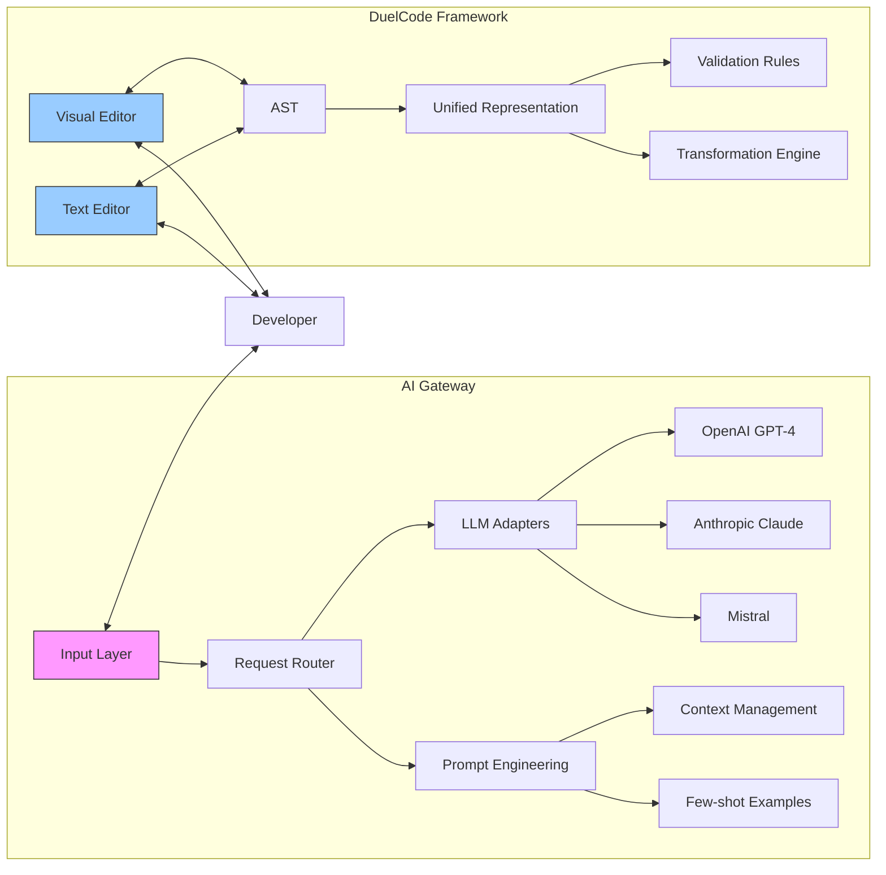
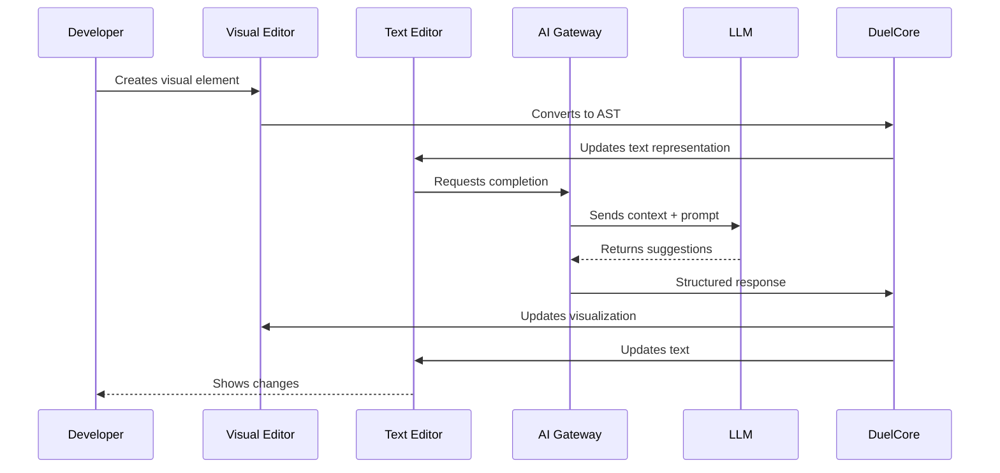

# AI Gateway + DuelCode Framework: The Neurodivergent Programming Revolution

## Core Thesis
**Programming languages are expressions of how minds think** - and HyperCode's AI Gateway and DuelCode Framework embody this principle by creating a symbiotic relationship between artificial intelligence and diverse cognitive patterns.

## 1. Architectural Overview

### 1.1 System Architecture


### 1.2 Data Flow Sequence


## 2. Key Innovations

### 2.1 Bidirectional Transformation Engine
```python
class BidirectionalTransformer:
    def __init__(self):
        self.visual_parser = VisualParser()
        self.text_parser = TextParser()
        self.validator = NeurodivergentValidator()
        
    def visual_to_ast(self, visual_elements):
        """Convert visual elements to AST"""
        ast = self.visual_parser.parse(visual_elements)
        return self.validator.validate(ast)
    
    def text_to_ast(self, code_text):
        """Convert text to AST"""
        ast = self.text_parser.parse(code_text)
        return self.validator.validate(ast)
    
    def ast_to_visual(self, ast):
        """Convert AST to visual elements"""
        return self.visual_parser.generate(ast)
    
    def ast_to_text(self, ast):
        """Convert AST to formatted code"""
        return self.text_parser.generate(ast)
```

### 2.2 Context-Aware AI Gateway
```python
class NeurodivergentAIGateway:
    def __init__(self):
        self.llm_clients = {
            'openai': OpenAIClient(),
            'claude': ClaudeClient(),
            'mistral': MistralClient()
        }
        self.context_manager = ContextManager()
        self.prompt_engine = PromptEngine()
        
    async def get_completion(self, request: CompletionRequest) -> CompletionResponse:
        # Get cognitive profile
        profile = self.context_manager.get_user_profile(request.user_id)
        
        # Prepare context
        context = self.context_manager.build_context(
            code=request.code,
            visual_context=request.visual_context,
            user_profile=profile
        )
        
        # Select and format prompt
        prompt = self.prompt_engine.create_prompt(
            task=request.task,
            context=context,
            preferences=profile.preferences
        )
        
        # Route to appropriate LLM
        llm_client = self.select_llm(profile)
        response = await llm_client.complete(prompt)
        
        # Post-process response
        return self.post_process(response, profile)
```

## 3. Performance Optimization

### 3.1 Caching Strategy
```python
class NeurodivergentCache:
    def __init__(self):
        self.semantic_cache = {}  # AST-based caching
        self.visual_cache = {}    # Visual pattern cache
        self.user_prefs = {}      # Per-user optimization settings
    
    def get_cache_key(self, ast, user_id):
        """Generate cache key based on AST structure and user preferences"""
        ast_hash = self.hash_ast(ast)
        return f"{user_id}:{ast_hash}"
    
    async def get_or_compute(self, key, compute_fn):
        """Get cached result or compute and cache"""
        if key in self.semantic_cache:
            return self.semantic_cache[key]
            
        result = await compute_fn()
        self.semantic_cache[key] = result
        return result
```

## 4. Real-World Use Cases

### 4.1 Visual Pattern Recognition
```python
# Example: Visual pattern for data processing
pattern = {
    "type": "data_pipeline",
    "stages": [
        {"type": "input", "source": "sensor_data.csv"},
        {"type": "filter", "condition": "value > threshold"},
        {"type": "transform", "operation": "normalize"},
        {"type": "output", "destination": "dashboard"}
    ]
}

# Converted to code by DuelCode
pipeline = (
    Pipeline()
    .from_csv("sensor_data.csv")
    .filter("value > threshold")
    .transform(normalize)
    .to_dashboard()
)
```

## 5. Getting Started

### 5.1 Installation
```bash
# Clone the repository
git clone https://github.com/welshDog/hypercode.git
cd hypercode

# Set up the environment
python -m venv venv
source venv/bin/activate  # On Windows: .\venv\Scripts\activate
pip install -r requirements.txt

# Start the development server
python -m hypercode.dev_server
```

### 5.2 Example: Creating a Simple Visual Program
```python
from hypercode import DuelCodeEngine, AIGateway

# Initialize components
duel = DuelCodeEngine()
ai = AIGateway()

# Create a simple visual program
visual_program = {
    "name": "Data Analyzer",
    "nodes": [
        {"id": 1, "type": "input", "label": "Load Data"},
        {"id": 2, "type": "process", "label": "Clean Data"},
        {"id": 3, "type": "output", "label": "Show Results"}
    ],
    "connections": [
        {"from": 1, "to": 2, "label": "raw_data"},
        {"from": 2, "to": 3, "label": "clean_data"}
    ]
}

# Convert to code
code = duel.visual_to_code(visual_program)
print("Generated Code:")
print(code)

# Get AI suggestions
suggestions = await ai.get_suggestions("How can I optimize this data pipeline?")
print("\nAI Suggestions:", suggestions)
```

## 6. Contributing

### 6.1 Development Setup
1. Fork the repository
2. Create a feature branch
3. Make your changes
4. Run tests: `pytest tests/`
5. Submit a pull request

### 6.2 Testing Strategy
```bash
# Run unit tests
pytest tests/unit

# Run integration tests
pytest tests/integration

# Run performance benchmarks
python -m tests.benchmarks
```

## 7. Roadmap

### Short-term (Next 3 Months)
- [ ] Enhanced visual editor with drag-and-drop
- [ ] Support for additional LLM providers
- [ ] Performance optimization for large codebases

### Medium-term (3-6 Months)
- [ ] Collaborative editing features
- [ ] Advanced debugging tools
- [ ] Plugin system for extensions

### Long-term (6+ Months)
- [ ] AI-powered refactoring
- [ ] Natural language to code
- [ ] Advanced visualization tools

---
*Documentation last updated: 2025-03-15*
*HyperCode - Programming for Every Mind*
