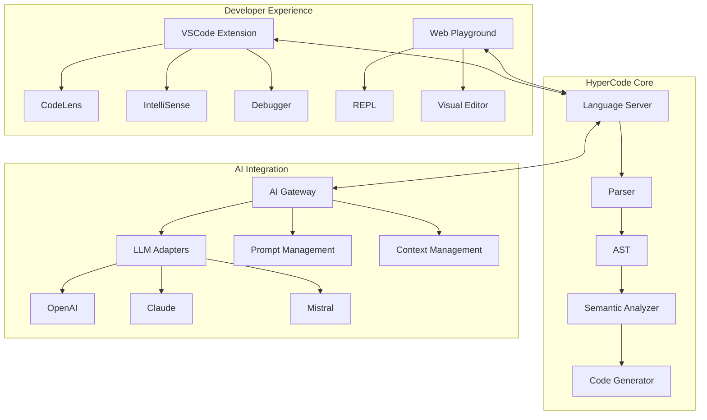
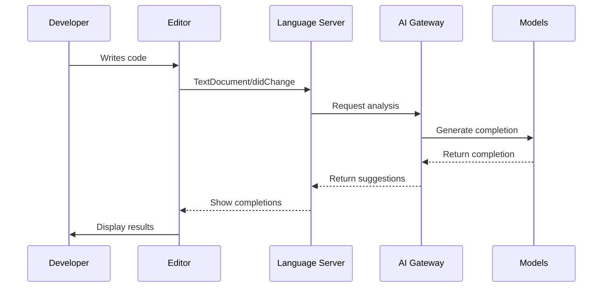

# HyperCode Architecture & CodeMap

## System Overview

## Core Components

### 1. Language Server
- **Purpose**: Implements the Language Server Protocol (LSP)
- **Features**:
  - Real-time syntax checking
  - Code completion
  - Go-to-definition
  - Find references
  - Hover documentation

### 2. AI Gateway
- **Purpose**: Central hub for all AI/ML operations
- **Components**:
  - Model routing and load balancing
  - Prompt templating
  - Response caching
  - Rate limiting
  - Fallback mechanisms

### 3. DuelCode Framework
- **Purpose**: Dual-representation programming system
- **Features**:
  - Visual and textual code synchronization
  - Bidirectional transformation
  - Validation rules
  - Template system

## Data Flow

## Development Workflow

1. **Local Development**
   - Write code in VSCode with HyperCode extension
   - Get real-time AI assistance
   - Run tests locally

2. **CI/CD Pipeline**
   - Automated testing
   - Performance benchmarking
   - Documentation generation
   - Container builds

3. **Deployment**
   - Containerized services
   - Kubernetes orchestration
   - Auto-scaling
   - Monitoring and logging

## Integration Points

### External Services
- **GitHub/GitLab**: Source control
- **Docker**: Containerization
- **Kubernetes**: Orchestration
- **Prometheus**: Monitoring
- **Grafana**: Visualization

## Performance Considerations

- **Caching**: Multi-level caching strategy
- **Concurrency**: Async/await patterns
- **Memory Management**: Efficient data structures
- **Network Optimization**: Connection pooling

## Security

- **Authentication**: OAuth2/OpenID Connect
- **Authorization**: Role-based access control
- **Data Protection**: Encryption at rest and in transit
- **Audit Logging**: Comprehensive activity tracking

## Monitoring & Observability

- **Metrics**: Prometheus integration
- **Logging**: Structured logging with ELK stack
- **Tracing**: Distributed tracing with Jaeger
- **Alerting**: AlertManager integration

## Future Extensions

- **Multi-language support**
- **Advanced refactoring tools**
- **Collaborative editing**
- **Enhanced visualization tools**

---
*Last Updated: $(Get-Date -Format "yyyy-MM-dd")*
