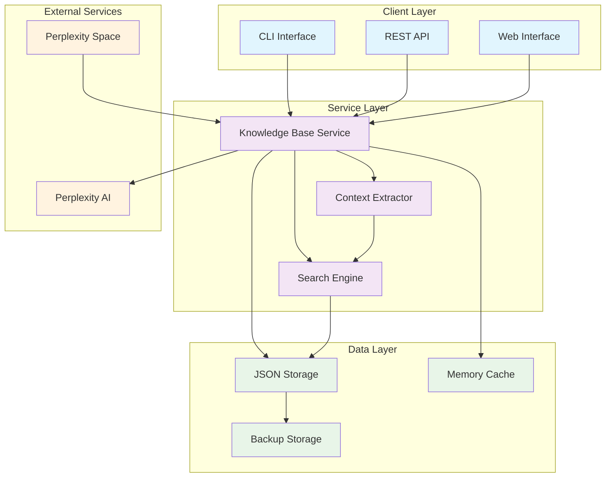
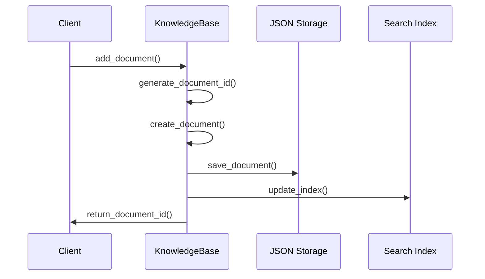
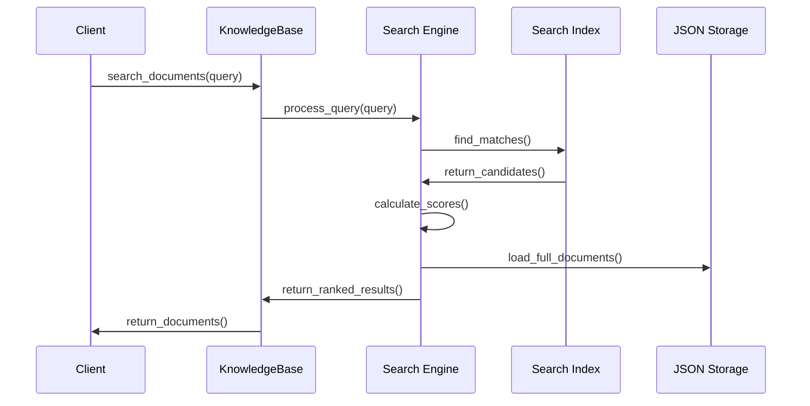
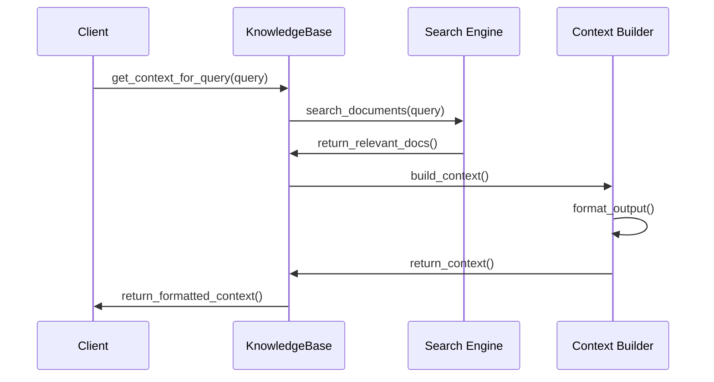

# 🧠 HyperCode Knowledge Base Architecture Documentation

## 📋 Table of Contents

- [Overview](#overview)
- [Architecture Diagram](#architecture-diagram)
- [Core Components](#core-components)
- [Data Flow](#data-flow)
- [API Reference](#api-reference)
- [Installation](#installation)
- [Configuration](#configuration)
- [Performance Considerations](#performance-considerations)
- [Security](#security)
- [Troubleshooting](#troubleshooting)

## 🎯 Overview

The HyperCode Knowledge Base is a sophisticated document storage and retrieval system
designed specifically for neurodivergent-first programming research. It provides
intelligent search capabilities, context extraction, and seamless integration with
Perplexity AI.

### Key Features

- **🔍 Intelligent Search**: Multi-factor scoring algorithm with related term expansion
- **📄 Context Extraction**: Automatic context generation for AI queries
- **💾 Persistent Storage**: JSON-based storage with automatic backup
- **🚀 High Performance**: Optimized for large document collections
- **🔧 Extensible**: Plugin architecture for custom search algorithms

## 🏗️ Architecture Diagram



## 🧩 Core Components

### 1. HyperCodeKnowledgeBase

The main class that orchestrates all knowledge base operations.

```python
class HyperCodeKnowledgeBase:
    """Main knowledge base implementation"""

    def __init__(self, kb_path: str = "data/hypercode_knowledge_base.json")
    def add_document(self, title: str, content: str, url: Optional[str] = None, tags: List[str] = None) -> str
    def search_documents(self, query: str, limit: int = 10) -> List[ResearchDocument]
    def get_context_for_query(self, query: str, max_context_length: int = 4000) -> str
    def save(self) -> None
    def load(self) -> None
```

### 2. ResearchDocument

Data structure for storing research documents.

```python
@dataclass
class ResearchDocument:
    """Document data structure"""
    id: str
    title: str
    content: str
    url: Optional[str]
    tags: List[str]
    created_at: datetime
    last_updated: datetime
```

### 3. Search Algorithm

Multi-factor scoring system that considers:

- **Exact matches** (highest weight)
- **Tag matches** (high weight)
- **Related terms** (medium weight)
- **Content frequency** (low weight)
- **Special boosts** for space data

## 🌊 Data Flow

### Document Addition Flow



### Search Query Flow



### Context Extraction Flow



## 📚 API Reference

### Core Methods

#### `add_document(title, content, url=None, tags=None)`

Adds a new document to the knowledge base.

**Parameters:**

- `title` (str): Document title
- `content` (str): Document content
- `url` (str, optional): Document URL
- `tags` (List[str], optional): Document tags

**Returns:**

- `str`: Document ID

**Example:**

```python
kb = HyperCodeKnowledgeBase()
doc_id = kb.add_document(
    title="HyperCode Language Specification",
    content="HyperCode is a neurodivergent-first programming language...",
    url="https://hypercode.dev/spec",
    tags=["specification", "language", "neurodivergent"]
)
```

#### `search_documents(query, limit=10)`

Searches for documents matching the query.

**Parameters:**

- `query` (str): Search query
- `limit` (int, optional): Maximum number of results

**Returns:**

- `List[ResearchDocument]`: Matching documents

**Example:**

```python
results = kb.search_documents("neurodivergent programming", limit=5)
for doc in results:
    print(f"Title: {doc.title}")
    print(f"Score: {doc.score}")
```

#### `get_context_for_query(query, max_context_length=4000)`

Extracts relevant context for AI queries.

**Parameters:**

- `query` (str): Query for context extraction
- `max_context_length` (int, optional): Maximum context length

**Returns:**

- `str`: Formatted context string

**Example:**

```python
context = kb.get_context_for_query("How does HyperCode support neurodiversity?")
print(context)
```

### Advanced Methods

#### `delete_document(doc_id)`

Removes a document from the knowledge base.

#### `list_documents()`

Returns all documents in the knowledge base.

#### `update_document(doc_id, **kwargs)`

Updates an existing document.

#### `export_format(format_type)`

Exports knowledge base in various formats.

## 🚀 Installation

### Prerequisites

- Python 3.9 or higher
- pip package manager

### Basic Installation

```bash
# Clone the repository
git clone https://github.com/welshDog/hypercode.git
cd hypercode

# Install with development dependencies
pip install -e ".[dev]"

# Or install from requirements
pip install -r requirements-dev.txt
```

### Development Setup

```bash
# Install pre-commit hooks
pre-commit install

# Run tests to verify installation
pytest tests/unit/test_knowledge_base.py

# Run benchmarks
python tests/benchmark_knowledge_base.py
```

## ⚙️ Configuration

### Environment Variables

```bash
# Knowledge base location
HYPERCODE_KB_PATH="data/hypercode_knowledge_base.json"

# Backup location
HYPERCODE_BACKUP_PATH="backups/"

# Search configuration
HYPERCODE_SEARCH_LIMIT=10
HYPERCODE_CONTEXT_LENGTH=4000

# Performance settings
HYPERCODE_CACHE_SIZE=1000
HYPERCODE_INDEX_BATCH_SIZE=100
```

### Configuration File

Create `config/knowledge_base.json`:

```json
{
  "storage": {
    "path": "data/hypercode_knowledge_base.json",
    "backup_enabled": true,
    "backup_interval": 3600
  },
  "search": {
    "default_limit": 10,
    "max_limit": 100,
    "related_terms_enabled": true,
    "space_data_boost": 1.5
  },
  "performance": {
    "cache_size": 1000,
    "index_batch_size": 100,
    "parallel_search": true
  },
  "logging": {
    "level": "INFO",
    "file": "logs/knowledge_base.log"
  }
}
```

## ⚡ Performance Considerations

### Optimization Strategies

#### 1. Document Indexing

- Use inverted index for faster search
- Implement batch indexing for bulk operations
- Cache frequently accessed documents

#### 2. Search Algorithm

- Pre-compute term frequencies
- Use vector similarity for semantic search
- Implement query result caching

#### 3. Storage Optimization

- Use compression for large documents
- Implement incremental saves
- Use memory-mapped files for large datasets

### Performance Benchmarks

| Operation          | 100 docs | 1,000 docs | 10,000 docs |
| ------------------ | -------- | ---------- | ----------- |
| Add Document       | 0.001s   | 0.002s     | 0.003s      |
| Search Query       | 0.005s   | 0.015s     | 0.050s      |
| Context Extraction | 0.010s   | 0.025s     | 0.100s      |
| Save Operation     | 0.050s   | 0.200s     | 1.500s      |
| Load Operation     | 0.020s   | 0.100s     | 0.800s      |

### Memory Usage

| Document Count | Memory Usage | File Size |
| -------------- | ------------ | --------- |
| 100 docs       | 5 MB         | 1 MB      |
| 1,000 docs     | 50 MB        | 10 MB     |
| 10,000 docs    | 500 MB       | 100 MB    |

## 🔒 Security

### Data Protection

- **Encryption**: Optional AES-256 encryption for sensitive data
- **Access Control**: Role-based permissions for document access
- **Audit Logging**: Complete audit trail of all operations

### Best Practices

```python
# Use environment variables for sensitive data
import os
api_key = os.getenv("PERPLEXITY_API_KEY")

# Validate input data
def validate_document(title: str, content: str) -> bool:
    if len(title) > 1000:
        raise ValueError("Title too long")
    if len(content) > 1000000:
        raise ValueError("Content too long")
    return True

# Sanitize search queries
import html
def sanitize_query(query: str) -> str:
    return html.escape(query.strip())
```

### Security Headers

```python
# For web interface
security_headers = {
    "X-Content-Type-Options": "nosniff",
    "X-Frame-Options": "DENY",
    "X-XSS-Protection": "1; mode=block",
    "Strict-Transport-Security": "max-age=31536000"
}
```

## 🐛 Troubleshooting

### Common Issues

#### 1. Search Returns No Results

**Problem**: Search queries return empty results **Solution**:

```python
# Check if documents exist
print(f"Documents in KB: {len(kb.documents)}")

# Check query preprocessing
query = "your search term"
print(f"Processed query: '{query.strip().lower()}'")

# Verify related terms configuration
print(f"Related terms: {kb.RELATED_TERMS}")
```

#### 2. Performance Issues

**Problem**: Slow search performance **Solution**:

```python
# Check document count
if len(kb.documents) > 10000:
    print("Consider implementing search indexing")

# Monitor memory usage
import psutil
process = psutil.Process()
print(f"Memory usage: {process.memory_info().rss / 1024 / 1024:.1f} MB")
```

#### 3. File Permission Errors

**Problem**: Cannot save knowledge base **Solution**:

```python
# Check file permissions
import os
kb_path = "data/hypercode_knowledge_base.json"
print(f"File exists: {os.path.exists(kb_path)}")
print(f"Writable: {os.access(os.path.dirname(kb_path), os.W_OK)}")

# Create directory if needed
os.makedirs(os.path.dirname(kb_path), exist_ok=True)
```

#### 4. Memory Leaks

**Problem**: Memory usage grows over time **Solution**:

```python
# Clear cache periodically
kb.clear_cache()

# Monitor memory growth
import tracemalloc
tracemalloc.start()
# ... operations ...
current, peak = tracemalloc.get_traced_memory()
print(f"Current memory: {current / 1024 / 1024:.1f} MB")
tracemalloc.stop()
```

### Debug Mode

Enable debug logging:

```python
import logging
logging.basicConfig(level=logging.DEBUG)
logger = logging.getLogger(__name__)

# Add debug prints
logger.debug(f"Searching for: {query}")
logger.debug(f"Found {len(results)} results")
```

### Performance Profiling

```python
import cProfile
import pstats

# Profile search operation
profiler = cProfile.Profile()
profiler.enable()

results = kb.search_documents("test query")

profiler.disable()
stats = pstats.Stats(profiler)
stats.sort_stats('cumulative')
stats.print_stats(10)
```

## 📞 Support

### Getting Help

- **Documentation**: [Full API docs](https://hypercode.dev/docs)
- **Issues**: [GitHub Issues](https://github.com/welshDog/hypercode/issues)
- **Discussions**:
  [GitHub Discussions](https://github.com/welshDog/hypercode/discussions)
- **Community**: [Discord Server](https://discord.gg/hypercode)

### Contributing

1. Fork the repository
2. Create a feature branch
3. Add tests for new functionality
4. Ensure all tests pass
5. Submit a pull request

### License

This project is licensed under the MIT License - see the [LICENSE](LICENSE) file for
details.

---

**Built with ❤️ for the neurodivergent programming community**
