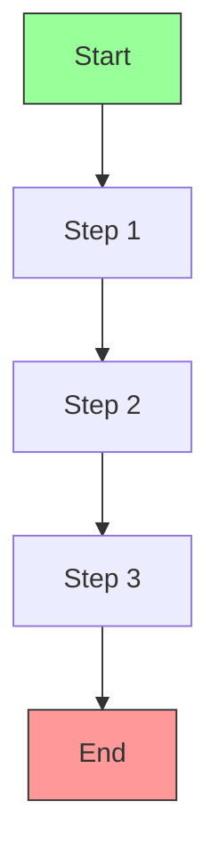
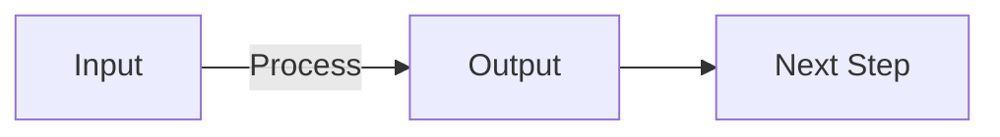
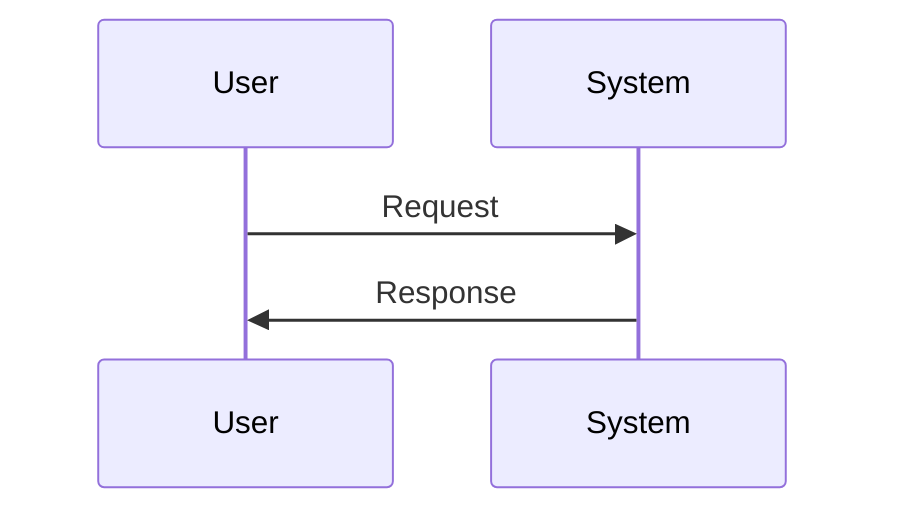

# 🧠 [Tutorial Title]: [Brief Description]

## 🎯 Learning Objective
- [ ] Understand [core concept 1]
- [ ] Learn how to [specific skill 1]
- [ ] Apply [concept] to [real-world scenario]

## 🧩 Prerequisite Knowledge
- [ ] Basic understanding of [related concept]
- [ ] Familiarity with [language/tool]
- [ ] [Optional] Previous experience with [related topic]

## 📋 Before You Start
- [ ] Install [required software]
- [ ] Clone the example repository
- [ ] Set up your development environment
- [ ] Complete the [prerequisite tutorial]

## 🎨 Visual Overview



## 🛠️ Tutorial Steps

### Part 1: [Part Title]

#### Visual Representation


#### Code Implementation
```python
def example_function():
    """Docstring explaining the function"""
    return "Hello, DuelCode!"
```

#### Key Concepts
- **Concept 1**: Explanation
- **Concept 2**: Explanation with `inline code`
- **Concept 3**: [Link to reference](#)

---

### Part 2: [Next Part Title]

#### Visual Workflow


#### Implementation Example
```javascript
// JavaScript example
const greeting = () => {
  console.log("Dual representation is powerful!");
};
```

## 🧪 Try It Yourself
1. [ ] Task 1: [Specific task]
   - Hint: [Helpful hint]
   - Solution: [Spoiler alert!](#)

2. [ ] Task 2: [Another task]
   - Hint: [Helpful hint]
   - Solution: [Spoiler alert!](#)

## 🔍 Review & Recap
- [ ] Key takeaway 1
- [ ] Key takeaway 2
- [ ] Key takeaway 3

## 🚀 Next Steps
- [ ] Explore [related topic]
- [ ] Try the [next tutorial]
- [ ] Build your own [project idea]

## 📚 Additional Resources
- [Documentation Link](#)
- [Related Tutorial](#)
- [Community Forum](#)

## ❓ Frequently Asked Questions

### Q: [Common question]?
A: [Clear, concise answer]

### Q: [Another question]?
A: [Helpful response with examples]

---

*Created with ❤️ by the HyperCode Team*  
*Last updated: [Date]*
