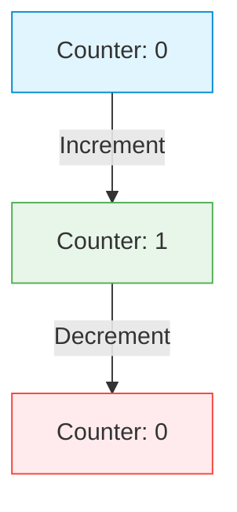
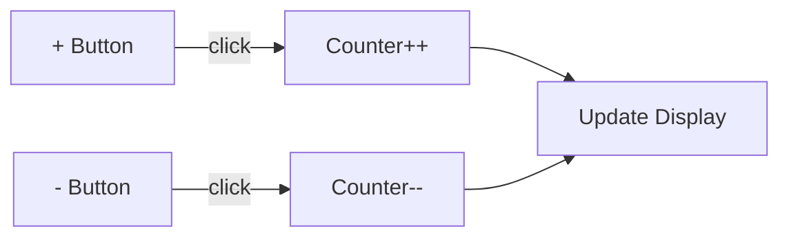
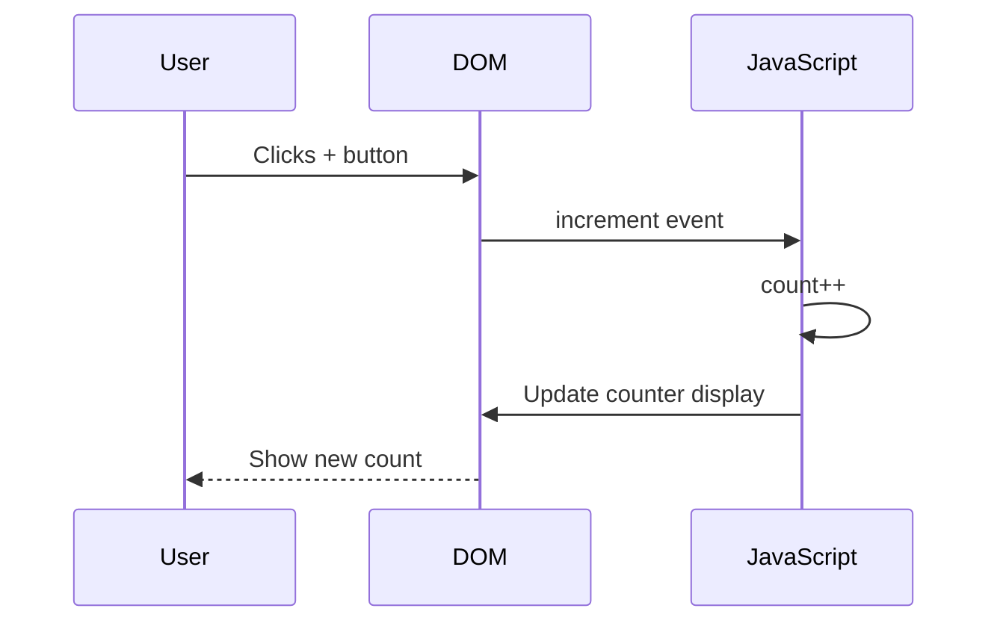

# 🧠 Building a Counter App with DuelCode

# 🎯 Learning Objective
- [ ] Understand DuelCode's dual representation
- [ ] Learn to create interactive components
- [ ] Connect visual elements to code logic

# 🧩 Prerequisite Knowledge
- [ ] Basic HTML/CSS/JavaScript.
- [ ] Understanding of event handling.
- [ ] Familiarity with DOM manipulation.

# 📋 Before You Start
- [ ] Install a modern web browser.
- [ ] Set up a code editor.
- [ ] Create a new project directory.

# 🎨 Visual Overview



# Part 1: Setting Up the Counter

### Visual Representation


### HTML Structure
```html-template
<div class="counter">
  <h2>Counter: <span id="count">0</span></h2>
  <div class="buttons">
    <button id="decrement">-</button>
    <button id="increment">+</button>
  </div>
</div>
```

### CSS Styling
```css
/* Counter styles */
.counter {
  text-align: center;
  font-family: Arial, sans-serif;
  padding: 2rem;
  max-width: 300px;
  margin: 0 auto;
  border-radius: 8px;
  box-shadow: 0 2px 4px rgba(0,0,0,0.1);
}

.buttons {
  margin-top: 1rem;
  display: flex;
  gap: 1rem;
  justify-content: center;
}

button {
  padding: 0.5rem 1rem;
  font-size: 1.2rem;
  cursor: pointer;
  border: none;
  border-radius: 4px;
  transition: transform 0.1s;
}

button:active {
  transform: scale(0.95);
}

#increment {
  background-color: #4caf50;
  color: white;
}

#decrement {
  background-color: #f44336;
  color: white;
}
```

# Part 2: Adding Interactivity

### Visual Data Flow


### JavaScript Logic
```javascript
// Get DOM elements
const countDisplay = document.getElementById('count');
const incrementBtn = document.getElementById('increment');
const decrementBtn = document.getElementById('decrement');

// Initial state
let count = 0;

// Update display function
function updateDisplay() {
  countDisplay.textContent = count;
  
  // Visual feedback
  if (count > 0) {
    countDisplay.style.color = '#4caf50';
  } else if (count < 0) {
    countDisplay.style.color = '#f44336';
  } else {
    countDisplay.style.color = '#333';
  }
}

// Event listeners
incrementBtn.addEventListener('click', () => {
  count++;
  updateDisplay();
});

decrementBtn.addEventListener('click', () => {
  count--;
  updateDisplay();
});

// Initial render
updateDisplay();
```

# 🧪 Try It Yourself
1. [ ] Add a reset button that sets the counter to 0
   - Hint: Create a new button and add an event listener
   - Solution: [Spoiler alert!](#)

2. [ ] Add keyboard support (arrow up/down)
   - Hint: Use `document.addEventListener('keydown', ...)`
   - Solution: [Spoiler alert!](#)

# 🔍 Review & Recap
- [ ] Learned to create dual visual/code representations
- [ ] Implemented interactive counter with visual feedback
- [ ] Understood the data flow in a simple web app

# 🚀 Next Steps
- [ ] Explore more complex state management
- [ ] Add animations to the counter
- [ ] Implement persistence using localStorage

# 📚 Additional Resources
- [MDN Web Docs](https://developer.mozilla.org/)
- [DuelCode Documentation](#)
- [Interactive JavaScript Tutorials](#)

# ❓ Frequently Asked Questions

### Q: How does DuelCode differ from traditional coding?
A: DuelCode provides both visual and code representations that stay in sync, making it easier to understand and modify applications.

### Q: Can I use DuelCode with frameworks like React or Vue?
A: Yes! The dual representation concept works with any framework. The visual elements map directly to the underlying code.

---

*Created with ❤️ by the HyperCode Team*  
*Last updated: December 2025*
